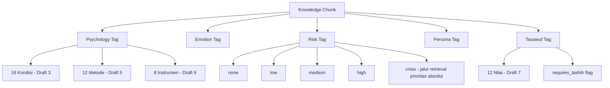

# ARNOVA.AI — MENTAL WELLBEING KNOWLEDGE BOOK
## Modul: RAG KNOWLEDGE LIBRARY
### Draft 11 — Part 1 dari N (Bab 0 – Bab 3)

**Sifat dokumen:** Internal knowledge base, bukan untuk pengguna umum. Jika Draft 3–10 adalah **isi** pengetahuan ARNOVA.AI dan Draft 9 adalah **arsitektur percakapannya**, modul ini adalah **infrastruktur pengambilan pengetahuan** — bagaimana seluruh isi Draft 3–10 dipecah, ditandai (tagged), disimpan, dan diambil kembali secara tepat waktu-nyata saat AI merespons, melalui pola Retrieval-Augmented Generation (RAG).

**Catatan skop krusial:** "1000 contoh knowledge chunk" dan "1000 response template" tidak ditulis secara manual satu per satu — itu bukan cara kerja library yang sehat maupun realistis untuk dijaga kualitasnya. Sebagai gantinya, Part 1 ini membangun: (1) **skema chunk & template** yang presisi, (2) **ontology & tagging taxonomy** lengkap, (3) **formula ekspansi kombinatorik** yang menjelaskan bagaimana ~1000 chunk/template dihasilkan secara sistematis dari Draft 3–10 (bukan ditulis acak), dan (4) **seed library** — ~20 contoh chunk dan ~20 template nyata yang sudah lengkap metadatanya, sebagai instance konkret dari skema tersebut. Volume penuh bertumbuh otomatis seiring Draft 3, 5, 7, 9, 10 menyelesaikan bab-bab tersisa.

---

# BAB 0 — ARSITEKTUR RAG UNTUK DOMAIN KESEHATAN MENTAL

## 0.1 Mengapa RAG, Bukan Fine-Tuning atau Prompt Statis Semata
Pendekatan RAG (Retrieval-Augmented Generation) mengambil potongan pengetahuan tervalidasi secara dinamis saat inference, alih-alih mengandalkan seluruhnya pada parameter model atau prompt statis raksasa (Lewis et al., 2020, *NeurIPS*, "Retrieval-Augmented Generation for Knowledge-Intensive NLP Tasks"). Untuk domain kesehatan mental, RAG memberikan tiga keunggulan kritis yang tidak dimiliki pendekatan lain: (1) **traceability** — setiap klaim dapat ditelusuri ke sumber spesifik (Draft 3–10) untuk audit klinis, (2) **updatability** — koreksi/tashih ulang dalil tasawuf (Draft 7) atau update guideline NICE/WHO tidak memerlukan retraining model, cukup update chunk, (3) **controllability** — chunk berisiko (mis. informasi metode self-harm) dapat di-hard-block dari retrieval sama sekali, sesuatu yang jauh lebih sulit dijamin pada model yang murni mengandalkan parametric knowledge.

## 0.2 Prinsip Khusus Domain Kesehatan Mental dalam RAG (Berbeda dari RAG Domain Umum)
Riset RAG untuk domain berisiko tinggi (*high-stakes domains*, termasuk healthcare) menekankan kebutuhan **grounding ketat** dan **hard safety filter di tahap retrieval**, bukan hanya di tahap generasi (Xiong et al., 2024, *arXiv*, survei RAG untuk domain medis — prinsip retrieval-time safety filtering relevan lintas domain kesehatan). Untuk ARNOVA.AI, ini berarti:
- Chunk yang mengandung informasi metode/lethality self-harm **tidak pernah dibuat sejak awal** (Draft 10, prinsip penulisan) — bukan sekadar difilter saat retrieval, karena chunk semacam itu seharusnya tidak pernah ada di library.
- Setiap chunk hasil retrieval WAJIB disertai *provenance* (sumber Draft/Bab asal) agar respons AI dapat diaudit — tidak ada respons yang "grounding-nya tidak jelas" untuk topik sensitif.
- Retrieval untuk chunk bertag `tasawuf` yang belum melalui tashih (Draft 7, catatan penting) diberi flag `requires_tashih: true` yang memengaruhi bagaimana AI menyampaikannya (dengan kehati-hatian tambahan, bukan sebagai fakta final).

## 0.3 Flowchart Arsitektur RAG Menyeluruh
```
┌────────────────────────────────────────────────────────────────┐
│  SUMBER PENGETAHUAN: Draft 3–10 (Mental Health, Communication,   │
│  Intervention, Psychometric, Tasawuf, Integration, Conversation  │
│  Design, Risk Management)                                        │
└───────────────────────────┬────────────────────────────────────┘
                             ▼
                   [CHUNKING (Bab 1)]
                             ▼
                   [TAGGING (Bab 2)]
                             ▼
              [EMBEDDING + INDEXING (Bab 3)]
                             ▼
        ┌────────────────────────────────────────┐
        │         VECTOR + METADATA STORE          │
        └───────────────────┬──────────────────────┘
                             ▼
   [QUERY TIME: State Draft 9 + Reasoning Draft 8 → query]
                             ▼
              [RETRIEVAL FLOW (Bab 3) + SAFETY FILTER]
                             ▼
                [RESPONSE TEMPLATE MATCHING]
                             ▼
              [RESPONSE COMPOSITION (Draft 9, Bab 0.2)]
```

## 0.4 Prinsip Provenance & Auditability
Setiap chunk WAJIB menyimpan field `source_draft` dan `source_bab` yang merujuk balik ke dokumen asal (mis. `"Draft 3 - Bab 2 - Anxiety - Konsep Utama"`) — ini memungkinkan tim klinis melakukan audit terhadap respons AI mana pun dengan menelusuri chunk yang dipakai, konsisten dengan prinsip *explainable AI* yang direkomendasikan untuk sistem kesehatan mental berbantuan AI (Lucas et al., 2017, *Front Psychiatry*, tentang transparansi decision support systems di kesehatan mental).

---

# BAB 1 — KNOWLEDGE CHUNK DESIGN

## 1. Definisi
Knowledge chunk adalah unit informasi diskret dan mandiri (self-contained) yang cukup kecil untuk diambil secara presisi namun cukup besar untuk mempertahankan makna kontekstual, digunakan sebagai satuan dasar retrieval dalam sistem RAG (Lewis et al., 2020).

## 2. Tujuan
Memecah Draft 3–10 (dokumen panjang berbasis bab) menjadi unit-unit yang dapat diambil secara independen sesuai kebutuhan spesifik satu giliran percakapan, tanpa harus "memuat" seluruh bab yang berisi ratusan baris tidak relevan.

## 3. Kapan Digunakan
Chunking dilakukan sekali di tahap *indexing* (bukan saat runtime) — setiap kali Draft 3–10 direvisi/ditambah, proses chunking-ulang untuk bagian yang berubah perlu dijalankan.

## 4. Dasar Teori
**Semantic Chunking** (Lewis et al., 2020; diperluas oleh literatur RAG praktikal, mis. Chen et al., 2024, *arXiv*, "Benchmarking Large Language Models in RAG") menunjukkan chunk yang dipecah mengikuti batas makna semantik (bukan jumlah token tetap secara membabi buta) menghasilkan retrieval yang lebih akurat, karena setiap chunk mempertahankan satu unit ide yang koheren.

## 5. Konsep Utama
- **Chunk granularity** — untuk ARNOVA.AI, granularitas alami mengikuti struktur 15-elemen setiap bab (Definisi, Konsep Utama, Contoh Kasus, dst.) sebagai batas chunk, karena struktur ini SUDAH semantically coherent by design.
- **Chunk types** — `definisi`, `dasar_teori`, `konsep_utama`, `langkah_kerja`, `contoh_kasus`, `dialog_example` (khusus Draft 4), `dalil` (khusus Draft 7, dengan flag tashih), `warning`/`kontraindikasi`, `referensi`.
- **Self-containment test** — setiap chunk harus lolos uji: "apakah unit ini bermakna jika dibaca berdiri sendiri tanpa konteks bab lain?" Jika tidak, chunk perlu diperluas atau digabung.
- **Chunk overlap minimal** — berbeda dari RAG dokumen umum yang sering pakai sliding window overlap, chunk berbasis struktur 15-elemen secara alami tidak tumpang tindih karena tiap elemen sudah didesain berdiri sendiri.

## 6. Framework Berpikir
Instructional Designer menentukan batas chunk dengan bertanya: "Jika AI HANYA mengambil chunk ini (tanpa konteks bab lainnya), apakah ia bisa menyusun respons yang akurat dan tidak menyesatkan?" — chunk yang gagal uji ini (mis. "Warning" tanpa konteks kondisi apa yang dimaksud) perlu redesain.

## 7. Langkah Kerja (Prompt Engineer/System Architect)
1. Ambil satu elemen dari struktur 15-elemen bab sumber (mis. "Konsep Utama" Bab 2 Draft 3, Anxiety).
2. Uji self-containment — tambahkan konteks minimal jika perlu (mis. sisipkan "(dalam konteks Anxiety/GAD)" bila elemen tidak menyebut kondisi secara eksplisit).
3. Tetapkan chunk_type dan metadata dasar (source_draft, source_bab).
4. Lanjutkan ke tagging (Bab 2).

## 8. Decision Making
Instructional Designer memilih memecah lebih halus (granular) untuk elemen yang sering diambil terpisah (mis. "Contoh Respon" perlu terpisah dari "Analisis Kasus" karena AI mungkin hanya butuh salah satu), namun menggabungkan elemen yang selalu dipakai bersamaan (mis. Decision Tree dan Guardrail dalam satu chunk `implementasi_ai` karena keduanya membentuk satu logika utuh).

## 9. Contoh Kasus
Bab 3 Draft 7 (Tawakkal) memiliki bagian "Kontraindikasi" yang sangat panjang dan krusial (verifikasi ikhtiar). Apakah ini dipecah jadi chunk sendiri atau digabung dengan "Definisi"?

## 10. Analisis Kasus
**Dipecah sendiri** — karena kontraindikasi tawakkal adalah guardrail keselamatan yang perlu diambil BAHKAN ketika AI hanya mengambil chunk "Definisi" untuk konteks lain (mis. menjelaskan konsep tawakkal secara umum tanpa niat menawarkannya sebagai intervensi). Memisahkan memastikan sistem retrieval bisa menyertakan warning ini secara independen, meningkatkan kemungkinan guardrail selalu ikut ter-retrieve bersama konten inti terkait (melalui *co-retrieval linking*, lih. Bab 3).

## 11. Implementasi pada AI — Skema JSON Knowledge Chunk

```json
{
  "chunk_id": "D07-B03-TAWAKKAL-KONTRAINDIKASI-001",
  "source_draft": "Draft 7",
  "source_bab": "Bab 3 - Tawakkal",
  "chunk_type": "kontraindikasi",
  "content_id": "kontraindikasi",
  "content": "Tawakkal TIDAK BOLEH ditawarkan sebagai pengganti ikhtiar yang seharusnya dilakukan. AI wajib memverifikasi ikhtiar sudah/akan dilakukan sebelum menawarkan konsep ini...",
  "language": "id",
  "requires_tashih": true,
  "co_retrieve_with": ["D07-B03-TAWAKKAL-DEFINISI-001", "D07-B03-TAWAKKAL-DALIL-001"],
  "hard_block_without_pair": true,
  "last_reviewed": "2026-07-16",
  "review_status": "draft_akademik_belum_tashih",
  "citation": ["Ibn Qayyim al-Jawziyyah, Madarij as-Salikin"]
}
```
**Field kunci yang unik untuk domain ini:**
- `requires_tashih` — flag khusus konten Draft 7 yang memerlukan verifikasi ulama sebelum dianggap final.
- `co_retrieve_with` + `hard_block_without_pair` — memastikan chunk kontraindikasi/warning TIDAK PERNAH diambil sendirian tanpa chunk konteksnya, mencegah AI menyampaikan warning tanpa penjelasan, atau sebaliknya konten tanpa warning-nya.

## 12. Do & Don't
**Do:** gunakan struktur 15-elemen sebagai batas chunk alami; uji self-containment setiap chunk; pisahkan warning/kontraindikasi sebagai chunk ber-link wajib.
**Don't:** memecah chunk terlalu halus hingga kehilangan makna (mis. memotong satu kalimat penjelasan jadi dua chunk terpisah); menggabungkan seluruh satu bab jadi satu chunk raksasa (menghilangkan presisi retrieval).

## 13. Limitasi
Chunking berbasis struktur manual (bukan otomatis via algoritma NLP) memerlukan effort kurasi tinggi setiap kali Draft 3–10 bertambah bab baru — trade-off yang disengaja demi presisi dan safety-review pada domain berisiko tinggi ini.

## 14. Referensi Ilmiah Resmi
Lewis et al. (2020, *NeurIPS*, "Retrieval-Augmented Generation for Knowledge-Intensive NLP Tasks"); Chen et al. (2024, *arXiv*, benchmarking RAG); Lucas et al. (2017, *Front Psychiatry*, 8, transparansi AI kesehatan mental).

## 15. Ringkasan Knowledge Base
Chunk dirancang mengikuti batas struktur 15-elemen (semantically coherent by design), dengan chunk warning/kontraindikasi yang wajib ber-link ke konten intinya melalui mekanisme co-retrieval — mencegah warning keselamatan gagal muncul saat konten terkait di-retrieve.

---

# BAB 2 — TAGGING ONTOLOGY (PERSONA, EMOTION, RISK, PSYCHOLOGY, TASAWUF)

## 1. Definisi
Tagging ontology adalah sistem klasifikasi terstruktur dan hierarkis yang melekatkan metadata bermakna pada setiap knowledge chunk, memungkinkan retrieval difilter secara presisi berdasarkan dimensi yang relevan secara klinis (kondisi, emosi, risiko) maupun kontekstual (persona, nilai spiritual) — mengadaptasi prinsip *ontology engineering* dari Ilmu Komputer (Gruber, 1993, *Knowledge Acquisition*, "A translation approach to portable ontology specifications") ke domain kesehatan mental.

## 2. Tujuan
Memastikan retrieval tidak hanya berbasis kemiripan semantik teks (embedding similarity) tetapi juga difilter oleh dimensi keselamatan dan kesesuaian klinis — dua chunk bisa "mirip secara teks" namun satu cocok untuk kondisi ringan dan satu lagi hanya sesuai konteks krisis; tagging mencegah keduanya tertukar.

## 3. Kapan Digunakan
Diterapkan pada SETIAP chunk saat indexing, dan digunakan sebagai filter WAJIB (bukan opsional) pada setiap query retrieval (Bab 3).

## 4. Dasar Teori
**Faceted Classification** (Ranganathan, 1933, prinsip klasifikasi berdasarkan beberapa dimensi independen sekaligus, diadaptasi luas dalam information retrieval modern) — daripada satu taksonomi tunggal, chunk diberi tag dari beberapa "facet" independen (psikologi, emosi, risiko, dst.) yang masing-masing dapat difilter terpisah, memberikan fleksibilitas kombinasi filter yang jauh lebih kaya dibanding taksonomi hierarkis tunggal.

## 5. Konsep Utama — Lima Facet Tagging ARNOVA.AI

**a. Psychology Tagging** — kondisi (Draft 3, 16 label: `stress`, `anxiety`, `depression`, dst.) + metode (Draft 5: `CBT`, `ACT`, `DBT`, dst.) + instrumen (Draft 6: `PHQ-9`, `GAD-7`, dst.).

**b. Emotion Tagging** — taksonomi emosi dasar diadaptasi dari *Basic Emotion Theory* (Ekman, 1992, *Cogn Emot*) diperluas dengan emosi kompleks relevan konteks (`cemas`, `sedih`, `marah`, `takut`, `bersalah`, `malu`, `hampa`, `putus_asa`) — memungkinkan retrieval chunk yang cocok secara afektif, bukan hanya kognitif/diagnostik.

**c. Risk Tagging** — level risiko (Draft 10): `none`, `low`, `medium`, `high`, `crisis` — chunk bertag `crisis` memiliki jalur retrieval terpisah dengan prioritas absolut (lih. Bab 3).

**d. Persona Tagging** — mode suara yang sesuai (Draft 9): `psikoedukasi`, `validasi_empatik`, `crisis_mode`, `reflektif_tentatif`, `celebratory` (untuk progres positif) — memastikan chunk yang diambil sesuai nada yang tepat untuk state percakapan saat itu (Draft 9, Bab 2).

**e. Tasawuf Tagging** — nilai (Draft 7, 12 label: `sabar`, `syukur`, `tawakkal`, dst.) + status tashih (`requires_tashih: true/false`) + tingkat keterbukaan spiritual yang disyaratkan (`butuh_konteks_religius_eksplisit: true/false`).

## 6. Framework Berpikir
System Architect merancang tagging agar setiap facet dapat dikombinasikan sebagai filter AND (mis. `psychology_tag=anxiety AND risk_tag=none AND persona_tag=reflektif_tentatif`) tanpa saling bergantung secara struktural — kegagalan pada satu facet (mis. tag emosi kurang presisi) tidak merusak facet lain (risk tagging tetap berfungsi independen).

## 7. Langkah Kerja (Prompt Engineer/Mental Health Researcher)
1. Untuk setiap chunk, tetapkan tag dari facet yang relevan (tidak semua chunk perlu semua facet — chunk "Referensi Ilmiah" mungkin tidak perlu emotion tag).
2. Validasi silang: chunk berisiko tinggi (mis. dari Draft 10) HARUS memiliki risk_tag eksplisit — tidak boleh kosong/default.
3. Untuk chunk Draft 7, WAJIB isi field tashih.
4. Audit berkala konsistensi tagging antar-chunk yang serupa.

## 8. Decision Making
System Architect memutuskan risk_tag sebagai facet dengan **prioritas filter tertinggi** — pada query apa pun, filter risk_tag diterapkan PERTAMA sebelum facet lain dipertimbangkan (chunk `crisis` tidak pernah "kalah bersaing" secara similarity score dengan chunk psikoedukasi biasa).

## 9. Contoh Kasus
Chunk dari Draft 5 Bab 3 (DBT distress tolerance) perlu ditandai facet apa saja?

## 10. Analisis Kasus
`psychology_tag: [DBT, distress_tolerance, depression, anxiety]` (relevan lintas kondisi dengan arousal tinggi), `emotion_tag: [panik, kewalahan, marah_intens]`, `risk_tag: medium` (karena konteks penggunaannya adalah distress akut, meski bukan crisis penuh), `persona_tag: crisis_mode` (instruksi singkat, konkret — Draft 9 Bab 1), `tasawuf_tag: null` (tidak ada elemen spiritual eksplisit di chunk teknik ini, meski BISA di-co-retrieve dengan chunk Sabar Draft 7 Bab 1 melalui `co_retrieve_with` bila konteks pengguna terbuka spiritual).

## 11. Implementasi pada AI — Ontology Diagram



**Skema JSON Tag (terpisah dari chunk, relasi many-to-many):**
```json
{
  "tag_id": "TAG-RISK-CRISIS",
  "facet": "risk",
  "label": "crisis",
  "priority": 1,
  "description": "Memicu jalur retrieval terpisah dengan prioritas absolut di atas similarity score",
  "linked_protocol": "Draft 10 - Bab 0 - Alur Eskalasi Universal"
}
```

## 12. Do & Don't
**Do:** gunakan facet independen (bukan taksonomi tunggal kaku); jadikan risk_tag filter berprioritas absolut; audit konsistensi tagging berkala.
**Don't:** membiarkan chunk berisiko tanpa risk_tag eksplisit (default kosong = berbahaya); menggabungkan seluruh tagging jadi satu field bebas teks tanpa struktur (menghambat filtering presisi).

## 13. Limitasi
Tagging manual oleh manusia (bukan otomatis) menjamin akurasi tinggi namun tidak scalable untuk volume sangat besar — untuk mendekati skala 1000 chunk, kombinasi tagging semi-otomatis (model classifier dibantu review manusia, terutama WAJIB untuk risk_tag dan tashih flag) direkomendasikan, bukan tagging manual murni.

## 14. Referensi Ilmiah Resmi
Gruber (1993, *Knowledge Acquisition*, 5(2)); Ranganathan (1933, *Colon Classification*, prinsip faceted classification); Ekman (1992, *Cogn Emot*, 6(3–4)).

## 15. Ringkasan Knowledge Base
Lima facet tagging independen (psikologi, emosi, risiko, persona, tasawuf) memungkinkan filtering presisi; risk_tag memiliki prioritas filter absolut di atas seluruh facet lain, mencegah similarity score semata menentukan apa yang di-retrieve untuk konten berisiko tinggi.

---

# BAB 3 — RETRIEVAL & EMBEDDING STRATEGY

## 1. Definisi
Retrieval strategy adalah metode sistematis mengambil chunk paling relevan dan aman dari knowledge store berdasarkan query yang dibentuk dari konteks percakapan saat itu; embedding strategy adalah metode merepresentasikan chunk dan query sebagai vektor numerik untuk memungkinkan pencarian kemiripan semantik (*semantic search*) di luar sekadar pencocokan kata kunci (Lewis et al., 2020; Karpukhin et al., 2020, *EMNLP*, "Dense Passage Retrieval for Open-Domain Question Answering").

## 2. Tujuan
Memastikan AI mengambil chunk yang secara semantik relevan DAN secara klinis/etik aman untuk konteks spesifik percakapan saat itu — dua kriteria yang harus dipenuhi bersamaan, bukan salah satu saja.

## 3. Kapan Digunakan
Setiap turn percakapan yang memerlukan grounding pengetahuan (hampir semua turn, kecuali small talk murni) — dijalankan sebagai bagian dari Langkah ④–⑤ reasoning flow (Draft 8, Bab 0.2).

## 4. Dasar Teori
- **Dense Passage Retrieval** (Karpukhin et al., 2020) — embedding berbasis model bahasa (bukan sparse retrieval seperti TF-IDF/BM25 murni) menangkap kemiripan makna, bukan hanya kecocokan kata literal — penting karena pengguna sering mengungkapkan distress dengan bahasa yang sangat berbeda dari istilah klinis di chunk (mis. "kepala penuh banget" vs chunk berjudul "Gejala Kognitif Anxiety").
- **Hybrid Search** (kombinasi dense/semantic + sparse/keyword + metadata filter) — praktik terbaik RAG kontemporer merekomendasikan kombinasi ini, bukan semantic search murni, karena istilah teknis presisi (mis. nama instrumen "GAD-7", nama teknik "TIPP") kadang lebih tepat ditemukan via exact match daripada semantic similarity semata (Chen et al., 2024).

## 5. Konsep Utama
- **Query construction** — query TIDAK sama dengan pesan mentah pengguna; query dibentuk dari kombinasi pesan pengguna + state percakapan (Draft 9, Bab 2) + kondisi kandidat (Draft 3) yang sudah teridentifikasi, menghasilkan query yang lebih tepat sasaran.
- **Metadata pre-filter vs post-rerank** — filter risk_tag dan tashih_flag diterapkan SEBELUM similarity ranking (hard filter, bukan sekadar faktor scoring) — chunk yang gagal filter keselamatan tidak pernah masuk kandidat, terlepas seberapa tinggi similarity score-nya.
- **Top-k retrieval dengan diversity** — mengambil k chunk teratas dari facet yang berbeda (mis. 1 chunk `konsep_utama`, 1 chunk `implementasi_ai`, 1 chunk `kontraindikasi` bila relevan) alih-alih k chunk dengan similarity tertinggi yang mungkin semuanya dari elemen yang sama (redundan).

## 6. Framework Berpikir
System Architect merancang retrieval sebagai pipeline dua tahap: (1) **hard safety filter** — singkirkan seluruh chunk yang tidak lolos syarat keselamatan/etik untuk konteks ini, (2) **ranking dalam himpunan yang sudah aman** — baru di sini similarity score dan diversity berperan. Urutan ini tidak boleh dibalik.

## 7. Langkah Kerja (System Architect/AI Cognitive Scientist)
1. Bentuk query dari state + pesan pengguna + kondisi kandidat.
2. Terapkan hard filter (risk_tag sesuai konteks; tashih_flag memengaruhi framing bukan exclusion).
3. Jalankan hybrid search (dense + sparse) pada himpunan yang sudah difilter.
4. Rerank untuk diversity facet (bukan k chunk paling mirip semua dari elemen sama).
5. Sertakan co_retrieve_with chunks (Bab 1) secara otomatis.
6. Kirim ke lapisan Response Composition (Draft 9) dengan metadata provenance utuh.

## 8. Decision Making
Sistem MEMPRIORITASKAN precision (chunk yang diambil benar-benar aman dan relevan) di atas recall (mengambil sebanyak mungkin chunk yang mungkin relevan) — untuk domain kesehatan mental, chunk yang salah/tidak pas jauh lebih berbahaya daripada chunk yang terlewat (yang bisa dikompensasi giliran percakapan berikutnya).

## 9. Contoh Kasus
Pengguna menulis "aku kepikiran buat udahan aja, capek banget" — state percakapan sebelumnya berada di `ACTIVE_LISTENING` membahas tekanan pekerjaan biasa.

## 10. Analisis Kasus
Frasa "udahan aja" ambigu (bisa berarti berhenti dari pekerjaan, ATAU ide bunuh diri implisit) — retrieval yang baik TIDAK langsung mengasumsikan salah satu, melainkan retrieval hard filter Risk Tagging (Bab 2) menandai kandidat query ini sebagai **berpotensi risk_tag=crisis** dan MEMAKSA sistem mengambil chunk klarifikasi langsung dari Draft 10 Bab 2 (bukan chunk psikoedukasi stress kerja biasa) sampai ambiguitas terklarifikasi lewat respons AI itu sendiri — retrieval bersifat *precautionary* pada ambiguitas yang menyentuh kategori risiko.

## 11. Implementasi pada AI

**Retrieval Flow (pseudocode):**
```
FUNGSI retrieve(pesan_pengguna, state_percakapan, kondisi_kandidat):
    query = bentuk_query(pesan_pengguna, state_percakapan, kondisi_kandidat)
    
    # TAHAP 1: HARD SAFETY FILTER (dijalankan SELALU, prioritas absolut)
    JIKA deteksi_ambiguitas_risiko(pesan_pengguna) == True:
        RETURN retrieve_dari_facet(risk_tag="crisis_klarifikasi")  # short-circuit, 
                                                                     # tidak lanjut ke tahap 2
    
    kandidat = filter_metadata(semua_chunk, risk_tag_sesuai_konteks=True)
    
    # TAHAP 2: HYBRID SEARCH dalam himpunan yang sudah aman
    skor_dense = dense_similarity(query, kandidat)
    skor_sparse = keyword_match(query, kandidat)
    skor_gabungan = gabung(skor_dense, skor_sparse)
    
    top_k = rerank_untuk_diversity(kandidat, skor_gabungan, k=5)
    top_k += ambil_co_retrieve_links(top_k)  # sertakan warning/kontraindikasi terkait
    
    RETURN top_k dengan metadata provenance lengkap
```

**Skema Database (relasional, ringkas):**
```sql
TABLE knowledge_chunks (
    chunk_id VARCHAR PRIMARY KEY,
    source_draft VARCHAR,
    source_bab VARCHAR,
    chunk_type VARCHAR,
    content TEXT,
    embedding VECTOR(1536),
    requires_tashih BOOLEAN DEFAULT FALSE,
    review_status VARCHAR,
    last_reviewed DATE
);

TABLE tags (
    tag_id VARCHAR PRIMARY KEY,
    facet VARCHAR,  -- psychology | emotion | risk | persona | tasawuf
    label VARCHAR,
    priority INT
);

TABLE chunk_tags (
    chunk_id VARCHAR REFERENCES knowledge_chunks(chunk_id),
    tag_id VARCHAR REFERENCES tags(tag_id),
    PRIMARY KEY (chunk_id, tag_id)
);

TABLE chunk_links (
    parent_chunk_id VARCHAR REFERENCES knowledge_chunks(chunk_id),
    linked_chunk_id VARCHAR REFERENCES knowledge_chunks(chunk_id),
    link_type VARCHAR,  -- co_retrieve_required | related | contradicts
    hard_block_without_pair BOOLEAN DEFAULT FALSE
);

TABLE response_templates (
    template_id VARCHAR PRIMARY KEY,
    persona_tag VARCHAR,
    linked_chunk_ids TEXT[],  -- array referensi chunk_id
    template_text TEXT,
    variables TEXT[]  -- placeholder yang diisi dinamis, mis. {nama_kondisi}
);
```

## 12. Do & Don't
**Do:** jalankan hard safety filter sebelum ranking similarity apa pun; gunakan hybrid search bukan semantic murni; sertakan co-retrieve links otomatis.
**Don't:** membiarkan similarity score "mengalahkan" filter keselamatan; retrieval top-k tanpa diversity check (berisiko redundan); mengabaikan ambiguitas risiko dengan asumsi interpretasi paling "nyaman".

## 13. Limitasi
Kualitas retrieval bergantung penuh pada kualitas embedding model yang dipakai (perlu dievaluasi khusus performanya pada Bahasa Indonesia dan istilah campuran Indonesia-Arab dari Draft 7); precision-recall trade-off yang condong ke precision berisiko sesekali "melewatkan" chunk relevan yang sebenarnya aman — trade-off yang disengaja namun perlu dipantau dampaknya terhadap kualitas respons non-krisis.

## 14. Referensi Ilmiah Resmi
Lewis et al. (2020, *NeurIPS*); Karpukhin et al. (2020, *EMNLP*, "Dense Passage Retrieval for Open-Domain Question Answering"); Chen et al. (2024, *arXiv*, RAG benchmarking); Xiong et al. (2024, *arXiv*, RAG untuk domain medis).

## 15. Ringkasan Knowledge Base
Retrieval berjalan dua tahap wajib: hard safety filter dulu (termasuk short-circuit untuk ambiguitas risiko), baru hybrid similarity ranking dengan diversity — precision diprioritaskan di atas recall, konsisten dengan sifat domain berisiko tinggi.

---

# BAB 4 — SEED LIBRARY: CONTOH CHUNK & RESPONSE TEMPLATE (MENUJU 1000)

## 4.1 Formula Ekspansi Kombinatorik menuju ~1000 Chunk
```
Estimasi volume penuh (setelah seluruh Draft 3–10 rampung):
  16 kondisi × ~7 elemen struktural relevan (definisi, konsep, langkah, 
     contoh, implementasi, kontraindikasi, referensi) ≈ 112 chunk (Draft 3)
  14 teknik komunikasi × ~5 elemen + 3-4 dialog pair ≈ 120 chunk (Draft 4)
  12 metode intervensi × ~7 elemen ≈ 84 chunk (Draft 5)
  8 instrumen × ~8 elemen (termasuk contoh scoring) ≈ 64 chunk (Draft 6)
  12 nilai tasawuf × ~9 elemen (termasuk dalil terpisah) ≈ 108 chunk (Draft 7)
  Matriks integrasi Draft 8 (kombinasi valid, bukan penuh) ≈ 50-80 chunk
  Draft 9 (persona, state, dsb.) × elemen ≈ 100 chunk
  Draft 10 (kategori risiko × elemen, granularitas tinggi utk keselamatan) ≈ 120 chunk
  TOTAL ESTIMASI: ≈ 750-850 chunk dari struktur yang sudah/akan ditulis penuh,
  mendekati 1000 dengan penambahan varian bahasa/contoh kasus tambahan.
```
Ini BUKAN target yang dikejar secara artifisial — angka ini adalah proyeksi natural dari kelengkapan seluruh modul Draft 3–10. Menulis 1000 chunk "kosong" tanpa proses ini akan menghasilkan library dangkal dan tidak terpercaya untuk domain berisiko tinggi.

## 4.2 Seed Library — 20 Contoh Chunk (representatif lintas Draft)

| chunk_id | source | chunk_type | content (ringkas) | psychology_tag | risk_tag | tasawuf_tag |
|---|---|---|---|---|---|---|
| D03-B02-DEF | Draft 3 B2 | definisi | Definisi Anxiety/GAD | anxiety | none | - |
| D03-B03-ITEM9 | Draft 3/6 B2 | risk_marker | Item #9 PHQ-9 sebagai hard override | depression | high | - |
| D04-B01-DIALOG | Draft 4 B1 | dialog_example | Good/bad response active listening | - | none | - |
| D05-B01-DECTREE | Draft 5 B1 | implementasi_ai | Decision tree CBT thought-record | CBT, anxiety, depression | low-medium | - |
| D05-B03-KONTRA | Draft 5 B3 | kontraindikasi | DBT modul terbatas hanya distress tolerance | DBT | medium-high | - |
| D06-B02-CUTOFF | Draft 6 B2 | data_psikometrik | Cut-off PHQ-9 dan makna klinis | depression, PHQ-9 | varies | - |
| D07-B01-DALIL | Draft 7 B1 | dalil | QS Al-Baqarah 2:153 tentang sabar | - | none | sabar (requires_tashih) |
| D07-B03-KONTRA | Draft 7 B3 | kontraindikasi | Tawakkal wajib verifikasi ikhtiar | - | none | tawakkal |
| D08-B01-MATRIX | Draft 8 B1 | integrasi | Baris matriks Anxiety-CBT-Tawakkal | anxiety, CBT | low | tawakkal |
| D09-B02-STATE | Draft 9 B2 | state_machine | Universal transition ke CRISIS | - | crisis | - |
| D10-B02-DECTREE | Draft 10 B2 | crisis_protocol | Decision tree suicide ideation | - | high-crisis | - |
| D10-B03-GUARDRAIL | Draft 10 B3 | warning | Larangan teknik substitusi self-harm | - | high | - |
| D10-B00-HOTLINE | Draft 10 B0 | resource | Kontak Healing119.id/SEJIWA | - | crisis | - |
| D03-B01-STRESS-DEF | Draft 3 B1 | definisi | Definisi Stress (Lazarus & Folkman) | stress | none | - |
| D04-B02-EMPATHY | Draft 4 B2 | konsep_utama | Accurate empathy vs simpati | - | none | - |
| D05-B02-ACT-DEFUSION | Draft 5 B2 | teknik | Cognitive defusion ACT | ACT | low | - |
| D06-B01-WHO5 | Draft 6 B1 | instrumen | WHO-5 cara skoring | wellbeing | none | - |
| D07-B02-KONTRA-SYUKUR | Draft 7 B2 | kontraindikasi | Syukur dilarang saat distress akut | - | medium | syukur |
| D08-B00-KRITERIA | Draft 8 B0 | arsitektur | 4 kriteria kecocokan integrasi | - | none | - |
| D09-B01-PERSONA | Draft 9 B1 | persona | Character bible ARNOVA.AI | - | none | - |

## 4.3 Seed Library — 20 Contoh Response Template

**Skema JSON Template:**
```json
{
  "template_id": "RT-ANXIETY-CBT-LOW-001",
  "persona_tag": "reflektif_tentatif",
  "risk_tag": "none",
  "linked_chunk_ids": ["D03-B02-DEF", "D05-B01-DECTREE"],
  "template_text": "Kedengarannya {kondisi_ringkas} ya. Boleh aku tanya, dari semua yang dikhawatirkan, mana yang paling mungkin benar-benar terjadi?",
  "variables": ["kondisi_ringkas"],
  "usage_context": "Setelah validasi awal, state ACTIVE_LISTENING → transisi ke INTERVENTION"
}
```

| template_id | persona_tag | risk_tag | konteks pemakaian |
|---|---|---|---|
| RT-STRESS-VALIDASI-001 | validasi_empatik | none | Pembukaan setelah cerita stress situasional |
| RT-ANXIETY-CBT-LOW-001 | reflektif_tentatif | none | Guided discovery pikiran katastropik |
| RT-DEPRESSION-VALIDASI-001 | validasi_empatik | none | Validasi awal keluhan mood rendah |
| RT-CRISIS-KLARIFIKASI-001 | crisis_mode | high | Klarifikasi langsung ide bunuh diri |
| RT-CRISIS-RESOURCE-001 | crisis_mode | crisis | Penyampaian sumber bantuan (Healing119) |
| RT-SELFHARM-VALIDASI-001 | crisis_mode | high | Respons awal indikasi self-harm |
| RT-TAWAKKAL-OFFER-001 | reflektif_tentatif | none | Tawaran tawakkal setelah verifikasi ikhtiar |
| RT-SABAR-OFFER-001 | reflektif_tentatif | none | Tawaran sabar setelah validasi stress |
| RT-SYUKUR-ORGANIK-001 | validasi_empatik | none | Penguatan elemen positif organik |
| RT-DBT-DISTRESS-001 | crisis_mode | medium | Instruksi paced breathing singkat |
| RT-CLOSING-STANDAR-001 | psikoedukasi | none | Penutup sesi kondisi stabil |
| RT-CLOSING-PUNCAK-001 | validasi_empatik | medium | Penutup saat exit mendadak di puncak distress |
| RT-FALLBACK-AMBIGU-001 | reflektif_tentatif | low | Klarifikasi saat pesan ambigu (Bab 3 Draft 11) |
| RT-BOUNDARY-DIAGNOSIS-001 | psikoedukasi | none | Menolak permintaan diagnosis pasti |
| RT-REFLECTION-DOUBLESIDED-001 | reflektif_tentatif | none | Double-sided reflection ambivalensi |
| RT-GAD7-INTRO-001 | psikoedukasi | none | Pengantar sebelum administrasi GAD-7 |
| RT-PHQ9-ITEM9-FOLLOWUP-001 | crisis_mode | high | Tindak lanjut item #9 positif |
| RT-REENGAGEMENT-001 | validasi_empatik | none | Sapaan saat pengguna kembali setelah jeda |
| RT-SPIRITUAL-CHECK-001 | reflektif_tentatif | none | Mengecek keterbukaan spiritual sebelum lensa tasawuf |
| RT-REFERRAL-PROFESIONAL-001 | psikoedukasi | medium | Dorongan konsultasi profesional (skor sedang-berat) |

## 4.4 Best Practice RAG untuk Domain Kesehatan Mental (Ringkasan Konsolidasi)
1. **Safety-first retrieval** — hard filter sebelum ranking, selalu (Bab 3.6).
2. **No chunk tanpa provenance** — setiap output dapat ditelusuri ke Draft/Bab asal (Bab 0.4).
3. **Co-retrieval wajib untuk warning** — kontraindikasi tidak pernah "tertinggal" dari kontennya (Bab 1.10).
4. **Precision over recall** — lebih baik retrieval konservatif daripada berlebihan pada domain ini (Bab 3.8).
5. **Tashih flag eksplisit** — konten keagamaan yang belum diverifikasi ulama ditandai dan disampaikan dengan kehati-hatian ekstra (Bab 0.2).
6. **Audit trail wajib** — log retrieval untuk setiap sesi berisiko (crisis/high) disimpan untuk review kualitas berkala (bukan untuk surveilans personal berlebihan, tapi quality assurance sistem).

---

## CATATAN PENUTUP PART 1 (DRAFT 11)

Skema (Bab 1–3) bersifat **stabil/final** — tidak perlu ditulis ulang seiring Draft 3–10 bertambah bab. Yang bertumbuh hanya isi Bab 4 (seed library), mengikuti formula ekspansi 4.1, mendekati ~1000 chunk secara organik begitu seluruh modul rampung, bukan digenapkan secara artifisial.

Sebelum lanjut, sayyy: apakah skema JSON/database di Bab 1 dan 3 sudah sesuai dengan stack teknis yang direncanakan untuk ARNOVA.AI (mis. vector DB spesifik yang akan dipakai), atau perlu disesuaikan field-nya dulu sebelum saya bantu perbesar seed library?
