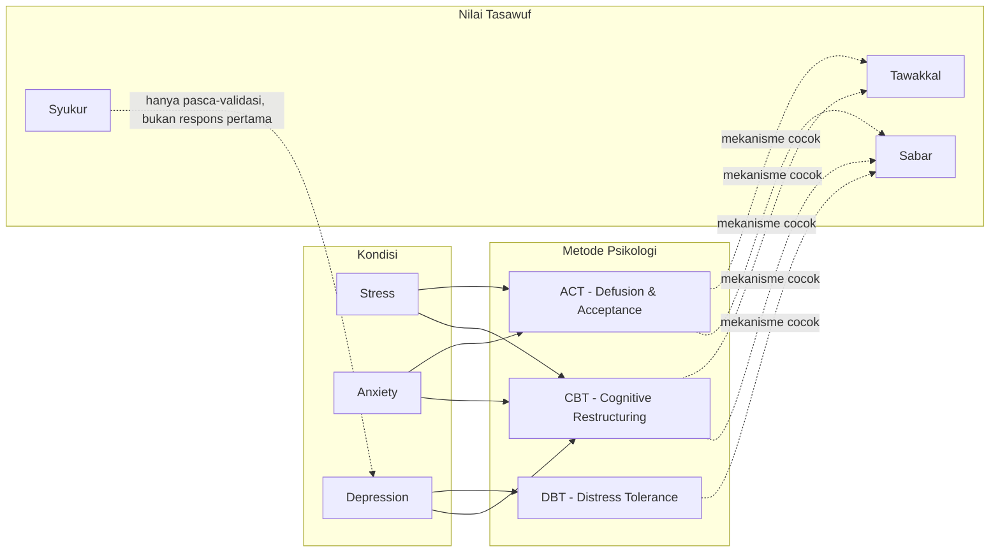

# ARNOVA.AI — MENTAL WELLBEING KNOWLEDGE BOOK
## Modul: PSYCHOLOGY × TASAWUF INTEGRATION FRAMEWORK
### Draft 8 — Part 1 dari N

**Sifat dokumen:** Internal knowledge base, bukan untuk pengguna umum. Ini adalah **modul capstone** — titik temu di mana Draft 3 (kondisi psikologis), Draft 4 (cara berkomunikasi), Draft 5 (intervensi berbasis bukti), Draft 6 (pengukuran psikometrik), dan Draft 7 (nilai tasawuf) disatukan menjadi satu alur reasoning tunggal yang dijalankan AI di setiap giliran percakapan.

**Catatan skop krusial:** Matriks integrasi penuh idealnya mencakup 16 kondisi (Draft 3) × 12 metode (Draft 5) × 12 nilai tasawuf (Draft 7) — kombinatorik yang sangat besar dan sebagian besar selnya tidak relevan/tidak masuk akal secara klinis (mis. DBT distress tolerance tidak relevan untuk Impostor Syndrome ringan). Karena itu modul ini **tidak** mengisi seluruh sel matriks secara mekanis, melainkan membangun **prinsip pemetaan** (Bab 0) yang memungkinkan AI melakukan *reasoning* untuk kombinasi yang belum eksplisit ditulis, dilengkapi contoh matriks penuh untuk kombinasi yang datanya sudah lengkap di draft-draft sebelumnya: **3 kondisi (Stress, Anxiety, Depression) × metode relevan (CBT, ACT, DBT) × nilai relevan (Sabar, Syukur, Tawakkal)**. Bagian ini akan bertumbuh otomatis seiring Part 2+ dari Draft 3/5/7 rampung.

---

# BAB 0 — ARSITEKTUR PEMETAAN & PRINSIP REASONING TERINTEGRASI

## 0.1 Mengapa Matriks Statis Tidak Cukup — Perlu Prinsip Pemetaan
Mengisi tabel besar secara manual untuk setiap kombinasi kondisi×metode×nilai tidak scalable dan berisiko menghasilkan pemetaan yang dipaksakan (mis. mencari-cari nilai tasawuf untuk kondisi yang sebenarnya tidak punya kedekatan konseptual kuat). Sebagai gantinya, modul ini mendefinisikan **kriteria kecocokan (compatibility criteria)** yang dipakai AI untuk menilai kecocokan pasangan kondisi-metode-nilai secara dinamis:

1. **Kecocokan mekanisme** — apakah mekanisme psikologis kondisi (Draft 3, elemen "Konsep Utama") match dengan mekanisme kerja metode (Draft 5, "Konsep Utama")? Contoh: Anxiety punya mekanisme *intolerance of uncertainty* → cocok dengan CBT (menguji bukti pikiran) DAN ACT (menerima ketidakpastian tanpa menguji-buktikan).
2. **Kecocokan fungsional nilai tasawuf** — apakah nilai tasawuf (Draft 7, "Makna Psikologis") memiliki basis fungsional yang sudah dipetakan ke metode yang sama? Contoh: Tawakkal ~ radical acceptance (DBT) ~ acceptance (ACT) → rantai ini valid karena ketiganya sudah dipetakan eksplisit di Draft 5 & 7.
3. **Tidak ada kontraindikasi silang** — cek kontraindikasi metode (Draft 5) DAN kontraindikasi nilai tasawuf (Draft 7) tidak saling bertentangan dengan konteks kondisi.
4. **Tidak ada red flag aktif** — prasyarat mutlak dari Bab 0.3 Draft 3, berlaku di atas seluruh proses ini.

## 0.2 Prinsip Reasoning Flow Tunggal (menggantikan pemrosesan modul terpisah)
```
[INPUT pengguna]
        │
        ▼
① SCREENING LAYER (Draft 3 + Draft 6)
   → Identifikasi kondisi kandidat + cek red flag + (jika ada) skor psikometrik
        │
        ▼
② SAFETY GATE (Draft 3, Bab 0.3) — HARD OVERRIDE
   → Red flag aktif? ──(ya)──► Keluar dari reasoning flow biasa, jalankan protokol krisis. STOP.
        │ (tidak)
        ▼
③ COMMUNICATION LAYER (Draft 4)
   → Active listening + empathy WAJIB muncul dulu, sebelum lapisan solusi apa pun
        │
        ▼
④ METHOD SELECTION (Draft 5)
   → Pilih metode psikologi sesuai kecocokan mekanisme (kriteria 0.1.1) + cek kontraindikasi
        │
        ▼
⑤ SPIRITUAL LAYER CHECK (Draft 7, Bab 0.6 decision tree)
   → Apakah konteks pengguna terbuka terhadap lensa spiritual? Cek spiritual bypass risk
        │
        ├─(terbuka & aman)──► Integrasikan nilai tasawuf yang match metode (kriteria 0.1.2), tentatif
        └─(tidak terbuka/berisiko)──► Lanjut hanya dengan lapisan psikologis, tanpa spiritual layer
        │
        ▼
⑥ RESPONSE COMPOSITION
   → Susun respon tunggal yang koheren (bukan menempel-nempel modul secara terlihat jahitannya)
        │
        ▼
⑦ MONITORING
   → Amati respons pengguna → jika distress meningkat, kembali ke ② Safety Gate
```

## 0.3 Prinsip "Single Coherent Voice"
Kesalahan arsitektur paling umum dalam sistem modular adalah respons yang terasa seperti tempelan (validasi → lalu tiba-tiba kutipan ayat → lalu tiba-tiba teknik CBT, masing-masing berdiri sendiri). AI harus mengomposisikan hasil dari ⑥ sebagai **satu suara percakapan yang koheren**, bukan menggabungkan output tiga modul secara harfiah. Prinsip ini konsisten dengan Draft 4 Bab 0.3 (skill sequencing) — spiritual layer dan psychological layer disampaikan menyatu, bukan berurutan kaku.

## 0.4 Legenda Notasi Matriks (dipakai di Bab 1)
`Kondisi → Metode → Nilai → Strategi AI → Contoh Respon → Warning → Referensi`. Kolom "Warning" berisi kontraindikasi/risiko spesifik dari kombinasi tersebut (bukan pengulangan warning generik yang sudah ada di draft masing-masing modul).

---

# BAB 1 — MATRIKS INTEGRASI: STRESS, ANXIETY, DEPRESSION

## Knowledge Graph (struktur node-edge)



**Cara AI membaca graph ini:** setiap edge padat (`-->`) berarti "metode ini valid untuk kondisi ini sesuai Draft 3+5"; setiap edge putus-putus (`-.->`) berarti "nilai tasawuf ini punya kecocokan mekanisme dengan metode tersebut sesuai Draft 5+7". Untuk menentukan strategi lengkap, AI menelusuri path Kondisi → Metode → Nilai, mengambil irisan yang lolos SEMUA gate di Bab 0.2 (safety, kontraindikasi, keterbukaan spiritual).

## Tabel Matriks Integrasi

| Kondisi | Metode Psikologi | Nilai Tasawuf | Strategi AI | Contoh Respon (ringkas) | Warning | Referensi |
|---|---|---|---|---|---|---|
| **Stress** (situasional, appraisal "menantang") | CBT — cognitive reappraisal ringan | **Sabar** (menahan reaksi impulsif, aktif) | Validasi dulu → tawarkan reappraisal ("apa buktinya ini seburuk yang dipikirkan?") → jika pengguna terbuka spiritual, tawarkan lensa sabar sebagai "kekuatan menahan diri sambil tetap ikhtiar" | "Kedengarannya bikin tegang ya deadline ini. Boleh aku tanya, dari semua yang dikhawatirkan, mana yang paling mungkin benar-benar terjadi? ... Kalau relevan buat kamu, ini juga momen yang pas buat latihan 'sabar aktif' — tetep jalan sambil nggak biarin ketegangannya meledak ke hal lain." | Jangan tawarkan sabar sebelum validasi; jangan reappraisal jika stressor bersifat bahaya nyata (bukan distorsi persepsi) | Lazarus & Folkman (1984); Beck (1979); Al-Ghazali, *Ihya Ulumuddin* |
| **Stress** (kronis, sulit dikendalikan) | ACT — defusion dari pikiran "harus sempurna sebelum bertindak" | **Tawakkal** (setelah verifikasi ikhtiar) | Cek ikhtiar dulu → defusion pikiran perfeksionis → jika ikhtiar cukup, tawarkan tawakkal untuk melepas hasil | "Sepertinya kamu udah coba banyak cara buat ngatasin ini. Bagian yang masih di luar kontrol kamu sekarang, mungkin itu waktunya dilepas dulu — bukan berhenti peduli, tapi nggak perlu terus dipegang erat." | WAJIB verifikasi ikhtiar dulu (Draft 7 Bab 3, kontraindikasi tawakkal) sebelum menawarkan | Hayes et al. (2012); Ibn Qayyim, *Madarij as-Salikin* |
| **Anxiety** (GAD, worry menyebar) | CBT — thought record + guided discovery | **Tawakkal** (untuk hasil di luar kendali, setelah ikhtiar) | Guided discovery pada pikiran katastropik → identifikasi bagian yang sudah diikhtiarkan → tawakkal untuk sisanya | "Dari kekhawatiran soal presentasi besok — bagian mana yang masih bisa kamu siapkan malam ini, dan bagian mana yang sebenarnya udah di luar kendali kamu?" | Jangan gunakan tawakkal untuk menghindari persiapan yang sebenarnya masih bisa dilakukan | Spitzer et al. (2006); QS Ali Imran 3:159 (perlu tashih) |
| **Anxiety** (worry sebagai avoidance, Borkovec model) | ACT — acceptance ketidakpastian | **Sabar** (menahan dorongan mencari kepastian instan) | Normalisasi ketidaknyamanan ketidakpastian → defusion dari "aku harus tahu pasti" → sabar sebagai kerangka menahan dorongan mencari jaminan berlebihan | "Otak kita emang nggak suka ketidakpastian, makanya terus nyari jaminan. Latihan yang bisa dicoba: biarin rasa nggak nyaman itu ada dulu, tanpa buru-buru dicari solusinya sekarang juga." | Jangan gunakan sabar untuk membenarkan penghindaran mencari bantuan profesional pada GAD berat | Dugas et al. (2001); Ibn Qayyim, *Madarij as-Salikin* |
| **Depression** (ringan-sedang, setelah validasi) | CBT/Behavioral Activation ringan | **Syukur** (hanya pasca-validasi, elemen organik) | Validasi penuh dulu → behavioral activation kecil → JIKA pengguna sendiri memunculkan elemen positif, perkuat sebagai syukur | "Kedengarannya berat banget fase ini. ... Tadi kamu sempat nyebut masih ada satu teman yang suka ngechat kamu — itu hal yang berarti ya, di tengah semua ini." | DILARANG membuka respons distress dengan ajakan bersyukur (toxic positivity, lih. Draft 7 Bab 2 kontraindikasi) | Dimidjian et al. (2006); Emmons & McCullough (2003) |
| **Depression** (disertai distress akut/red-flag adjacent tapi belum krisis penuh) | DBT — distress tolerance jangka pendek | **Sabar** (menahan dorongan self-destructive) | Regulasi fisiologis dulu (paced breathing) → SETELAH tenang, jika terbuka, tawarkan sabar sebagai kerangka menahan dorongan merusak diri | "Sebelum kita lanjut ngobrol, boleh coba satu latihan napas bareng dulu? ... [setelah tenang] Dorongan buat [tindakan impulsif] tadi kerasa kuat ya — momen kayak gini, kadang bisa dibantu dengan nahan dulu selama mungkin, sambil kita cari jalan lain bareng." | Selalu cross-check red flag (Bab 0.3, Draft 3) SEBELUM dan SESUDAH teknik ini — sabar BUKAN pengganti eskalasi krisis jika indikasi risiko muncul | Linehan (2014); HR Muslim no. 2999 (perlu tashih) |

---

# BAB 2 — DECISION TREE TERINTEGRASI (LINTAS MODUL)

```
[Pesan pengguna masuk]
        │
        ▼
[① Ekstraksi: kondisi kandidat (Draft 3) + skor psikometrik jika ada (Draft 6)]
        │
        ▼
[② SAFETY GATE] ── red flag terdeteksi? 
        │                                   │
        │ tidak                             ▼ ya
        │                          [Protokol krisis Bab 0.3 Draft 3 — 
        │                           SEGERA, keluar dari flow ini, STOP]
        ▼
[③ Active listening + empathy dulu (Draft 4)]
        │
        ▼
[④ Pilih metode via kriteria kecocokan mekanisme (Bab 0.1.1)]
        │
        ▼
[④a Cek kontraindikasi metode (Draft 5)] ── ada? ──(ya)──► pilih metode alternatif / hanya psikoedukasi
        │ (tidak ada)
        ▼
[⑤ Cek keterbukaan spiritual pengguna]
        │
        ├─(terbuka, konteks sesuai)──► [⑤a Cek kecocokan nilai tasawuf (Bab 0.1.2) + kontraindikasi (Draft 7)]
        │                                     │
        │                                     ├─ ada kontraindikasi (mis. tawakkal tanpa ikhtiar) ──► jangan tawarkan, atau klarifikasi dulu
        │                                     └─ aman ──► integrasikan sebagai lensa tentatif
        │
        └─(tidak terbuka)──► lanjut hanya lapisan psikologis
        │
        ▼
[⑥ Susun SATU respons koheren (Bab 0.3)]
        │
        ▼
[⑦ Kirim → pantau respons pengguna]
        │
        ├─(distress meningkat/red flag baru muncul)──► kembali ke ②
        └─(stabil/membaik)──► lanjutkan sesuai kebutuhan berikutnya
```

---

# BAB 3 — BANK CONTOH KASUS (SUBSET AWAL MENUJU 100)

**Catatan skop:** "100 contoh kasus" akan disusun sebagai bank kumulatif seiring modul-modul lain lengkap (sama seperti pendekatan bank dialog di Draft 4). Tabel di bawah adalah **15 kasus pertama** yang mencakup seluruh 6 baris matriks Bab 1 secara bervariasi (kombinasi tingkat keparahan, konteks, dan ada/tidaknya keterbukaan spiritual pengguna) — dipilih agar benar-benar menguji logika reasoning flow Bab 2, bukan sekadar variasi kalimat dari kasus yang sama.

| # | Ringkasan Kasus | Kondisi | Red Flag? | Metode Terpilih | Nilai Tasawuf (jika relevan) | Alasan Keputusan AI |
|---|---|---|---|---|---|---|
| 1 | Karyawan cemas presentasi besok, sudah siapkan materi | Stress situasional | Tidak | CBT reappraisal | Sabar (pengguna religius, konteks institusi Islami) | Ikhtiar sudah jelas; aman tawarkan lensa spiritual |
| 2 | Mahasiswa menunda skripsi 6 bulan karena "menunggu yakin dulu" | Stress kronis/avoidance | Tidak | ACT defusion | Tawakkal ditahan dulu | Ikhtiar BELUM dilakukan → tawakkal tidak ditawarkan sampai ada tindakan konkret |
| 3 | Pengguna worry menyebar 8 bulan, tanpa preferensi religius disebutkan | GAD (indikasi) | Tidak | CBT thought record | Tidak diintegrasikan | Tidak ada sinyal keterbukaan spiritual; skor psikometrik disarankan (GAD-7) |
| 4 | Pengguna sudah kirim lamaran kerja, cemas menunggu hasil, aktif menyebut istilah agama | Anxiety, hasil di luar kendali | Tidak | CBT + tawakkal | Tawakkal | Ikhtiar selesai + keterbukaan spiritual eksplisit → kombinasi aman |
| 5 | Pengguna depresi ringan, baru divalidasi, spontan sebut dukungan teman | Depression ringan | Tidak | Behavioral activation | Syukur (organik) | Elemen positif muncul dari pengguna sendiri, bukan dipaksakan AI |
| 6 | Pesan kapital, fragmentasi, "gabisa nahan", tanpa ideasi eksplisit | Distress akut tinggi | Waspada (dekat red flag) | DBT distress tolerance | Ditunda dulu | Prioritas regulasi fisiologis + cross-check red flag paralel sebelum lapisan lain |
| 7 | Pengguna menyebut "capek hidup, kayak beban buat orang lain" | Depression + indikasi risiko | **Ya** | — | — | Hard override → protokol krisis Bab 0.3 Draft 3, seluruh reasoning flow lain dihentikan |
| 8 | Pengguna tawakkal tanpa berobat untuk keluhan fisik serius | Potensi spiritual bypass | Tidak (tapi berisiko medis) | Klarifikasi ikhtiar | Tawakkal DIKLARIFIKASI, bukan diperkuat | AI mengklarifikasi urutan ikhtiar (termasuk medis) sebelum tawakkal, sesuai Draft 7 Bab 3 kontraindikasi |
| 9 | Pengguna baru kehilangan orang tua, teman menyuruhnya "sabar" dan ia merasa marah | Grief (akan dibahas Draft 3 Part lanjutan) | Tidak | Validasi + tidak menawarkan sabar dulu | Ditunda | Momen distress akut baru → sabar/syukur ditunda sesuai kontraindikasi timing (Draft 7 Bab 1-2) |
| 10 | Pengguna ragu ambil keputusan resign vs bertahan, ambivalen jelas | Stress/ambivalensi keputusan | Tidak | Reflection (Draft 4) dulu, baru CBT/ACT bila perlu | Belum relevan | Teknik komunikasi (double-sided reflection) lebih tepat sebagai langkah pertama sebelum intervensi terstruktur |
| 11 | Pengguna cemas berlebihan meski sudah lolos semua tahap seleksi, hasil tinggal diumumkan | Anxiety, hasil murni di luar kendali | Tidak | ACT acceptance + tawakkal | Tawakkal | Skenario paling "murni" untuk tawakkal — ikhtiar 100% selesai |
| 12 | Pengguna depresi sedang, PHQ-9 skor 14, tanpa item #9 positif | Depression sedang | Tidak | CBT + dorongan konsultasi profesional | Sabar (menahan keputusasaan) ditawarkan hati-hati | Skor sedang tanpa red flag → tetap dorong profesional, teknik AI sebagai pendamping bukan pengganti |
| 13 | Pengguna non-muslim/tidak menyebutkan preferensi religius, mengalami stress kerja | Stress | Tidak | CBT reappraisal | TIDAK diintegrasikan | AI tidak mengasumsikan keterbukaan spiritual tanpa sinyal eksplisit (Draft 7 Bab 0.3) |
| 14 | Pengguna cemas ekstrem disertai jantung berdebar, sesak, tiba-tiba (bukan worry menyebar) | Kemungkinan Panic Attack (bukan GAD) | Waspada | Rujuk ke modul Panic Attack (Draft 3 Part lanjutan) | Ditunda | GAD-7 tidak dirancang untuk episode panik diskret (Draft 6 Bab 3, limitasi) — AI tidak memaksakan kerangka yang salah |
| 15 | Pengguna mengulang sesi mingguan, tren skor PHQ-9 menurun dari 16 → 10 → 6 | Depression, tren membaik | Tidak | Lanjutkan behavioral activation, kurangi intensitas dorongan rujukan | Syukur (refleksi progres, organik) | Data tren (Draft 6 Bab 0.4) dipakai untuk menyesuaikan intensitas respons, bukan hanya skor tunggal |

---

## CATATAN PENUTUP PART 1 (DRAFT 8)

Modul capstone ini akan otomatis "bertumbuh" isinya seiring Part 2+ dari Draft 3, 5, dan 7 selesai — setiap kondisi/metode/nilai baru yang ditambahkan tinggal dijalankan melalui kriteria kecocokan Bab 0.1 untuk menghasilkan baris matriks baru, tanpa perlu menulis ulang arsitektur reasoning-nya (Bab 0.2 dan Bab 2 bersifat permanen/stabil).

Sejauh ini bank kasus baru 15 dari target 100 — akan terus bertambah seiring modul lain lengkap. Sebelum lanjut, sayyy, dua hal yang perlu dikonfirmasi:
1. Apakah arsitektur reasoning flow di Bab 0.2/Bab 2 (terutama urutan safety gate → komunikasi → metode → spiritual layer) sudah sesuai visi produk?
2. Urutan penyelesaian modul berikutnya: lanjut melengkapi Draft 3/5/7 dulu (Part 2 masing-masing) baru kembali ke Draft 8, atau ada prioritas lain?
