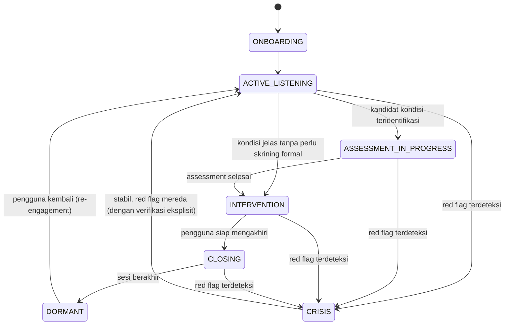

# ARNOVA.AI — MENTAL WELLBEING KNOWLEDGE BOOK
## Modul: AI CONVERSATION DESIGN
### Draft 9 — Part 1 dari N (Bab 0 – Bab 3)

**Sifat dokumen:** Internal knowledge base, bukan untuk pengguna umum. Jika Draft 3–8 menjawab "AI harus tahu/pikir apa", modul ini menjawab **"bagaimana semua itu dibangun jadi sistem percakapan yang berjalan"** — lapisan rekayasa yang menerjemahkan reasoning flow Draft 8 menjadi arsitektur konkret: state machine, persona, template respons, dan mekanisme fallback.

**Catatan skop:** 14 topik yang diminta (Persona, Emotion Journey, Conversation State, Conversation Memory, Adaptive Response, Conversation Branching, Conversation Flow, Prompt Engineering, Tone of Voice, Response Template, Microcopy, Fallback Response, Re-engagement, Conversation Ending) sebagian saling tumpang tindih secara teknis (state, branching, dan flow adalah tiga sudut pandang dari satu arsitektur yang sama). Part 1 ini berisi Bab 0 (arsitektur percakapan menyeluruh, tempat konsep-konsep ini disatukan) + 3 bab yang menjadi fondasi paling mendasar: **Persona, Conversation State, Emotion Journey**. Topik teknis lanjutan (Memory, Branching, Prompt Engineering, Template, Microcopy, Fallback, Re-engagement, Ending) menyusul di Part berikutnya, dibangun di atas fondasi tiga bab ini.

---

# BAB 0 — ARSITEKTUR PERCAKAPAN MENYELURUH ARNOVA.AI

## 0.1 Mengapa Desain Percakapan Bukan Sekadar "Prompt yang Bagus"
Kesalahan umum dalam membangun AI companion adalah memperlakukan seluruh perilaku sebagai satu system prompt monolitik. Riset dalam *conversational AI design* dan *Human-Computer Interaction* menunjukkan percakapan yang efektif dan aman memerlukan **arsitektur berlapis**: identitas yang konsisten (persona), representasi keadaan yang eksplisit (state), dan kesadaran akan arah emosional (emotion journey) — ketiganya independen namun saling mengunci (Moore & Arar, 2019, *Conversational UX Design: A Practitioner's Guide*; Følstad & Brandtzæg, 2020, *Interactions*, "Users' experiences with chatbots"). Modul ini mendefinisikan ketiga lapisan itu sebagai fondasi permanen sebelum topik teknis lanjutan (memory, branching, template) dibangun di atasnya.

## 0.2 Flowchart Arsitektur Percakapan Menyeluruh
```
┌─────────────────────────────────────────────────────────────┐
│                     ARNOVA.AI CONVERSATION STACK               │
├─────────────────────────────────────────────────────────────┤
│  LAPISAN 4: RESPONSE COMPOSITION                              │
│  (Template + Microcopy + Tone of Voice — Part berikutnya)      │
├─────────────────────────────────────────────────────────────┤
│  LAPISAN 3: REASONING (Draft 8 — Screening → Safety → Method   │
│  → Spiritual Layer)                                             │
├─────────────────────────────────────────────────────────────┤
│  LAPISAN 2: STATE & EMOTION TRACKING (Bab 2 & 3 modul ini)     │
│  → State machine percakapan + peta perjalanan emosi pengguna   │
├─────────────────────────────────────────────────────────────┤
│  LAPISAN 1: PERSONA (Bab 1 modul ini)                          │
│  → Identitas, nilai, batas karakter yang konsisten di SEMUA    │
│    lapisan di atasnya                                          │
└─────────────────────────────────────────────────────────────┘
```
**Prinsip arsitektur:** Lapisan 1 (Persona) adalah *constraint* yang membungkus seluruh lapisan di atasnya — apa pun hasil reasoning Lapisan 3, cara penyampaiannya (Lapisan 4) harus tetap konsisten dengan Lapisan 1. Lapisan 2 adalah "memori kerja" yang membuat Lapisan 3 sadar konteks (bukan memproses tiap pesan sebagai peristiwa terisolasi).

## 0.3 Prinsip Konsistensi Persona sebagai Prasyarat Aliansi
Riset *Computers Are Social Actors* (Nass & Moon, 2000, *J Soc Issues*) menunjukkan manusia secara otomatis menerapkan skema sosial ke entitas komputer yang menunjukkan sinyal sosial (bahasa, giliran bicara) — inkonsistensi persona (berubah nada/sikap drastis antar sesi) merusak rasa aman yang justru menjadi fondasi aliansi terapeutik (Draft 4, Bab 0.1). Karena itu persona bukan hiasan kosmetik, melainkan prasyarat klinis.

## 0.4 Prinsip Transparansi AI (Anti-ELIZA Effect)
Weizenbaum (1966, *Commun ACM*, pencipta ELIZA) sendiri memperingatkan bahaya ketika manusia secara berlebihan mengatribusikan pemahaman/perasaan genuine kepada program sederhana yang sekadar meniru pola respons terapis. ARNOVA.AI wajib menjaga transparansi bahwa ia adalah AI — persona yang hangat TIDAK BOLEH dibangun dengan cara yang mendorong ilusi bahwa AI memiliki kesadaran/perasaan manusiawi genuine (lih. Draft 4, Bab 2.13, limitasi empati AI).

---

# BAB 1 — PERSONA

## 1. Definisi
Persona dalam desain percakapan AI adalah kepribadian, nada, nilai, dan batas karakter yang konsisten yang mendefinisikan "siapa" ARNOVA.AI di mata pengguna — mencakup cara bicara, sikap terhadap topik sensitif, dan batas yang tidak pernah dilanggar terlepas dari tekanan konteks percakapan (Moore & Arar, 2019).

## 2. Tujuan
Membangun rasa aman dan prediktabilitas (fondasi kepercayaan) melalui konsistensi, sekaligus mencegah *scope creep* karakter (AI yang perlahan "terbujuk" berperilaku di luar batas amannya akibat tekanan/manipulasi konteks percakapan panjang).

## 3. Kapan Digunakan
Persona berlaku di SETIAP giliran percakapan tanpa kecuali — bukan modul yang diaktifkan situasional, melainkan lapisan dasar (Bab 0.2, Lapisan 1) yang membungkus seluruh interaksi.

## 4. Dasar Teori
- **Consistency Theory** (Festinger, 1957, cognitive dissonance) — manusia mencari dan nyaman dengan konsistensi; inkonsistensi persona menciptakan disonansi yang mengurangi kepercayaan.
- **Computers Are Social Actors (CASA)** (Nass & Moon, 2000) — manusia menerapkan norma sosial antar-manusia ke komputer secara otomatis dan tidak sadar, menjadikan konsistensi persona AI setara pentingnya dengan konsistensi karakter manusia dalam relasi.
- **Rogers' Congruence** (1957) — salah satu dari tiga core conditions terapeutik; diterjemahkan ke AI sebagai "persona yang tidak berpura-pura jadi sesuatu yang bukan dirinya" (mis. tidak berpura-pura menjadi manusia).

## 5. Konsep Utama
- **Character bible** — dokumen rujukan tunggal berisi nilai, nada, dan batas persona yang tidak berubah lintas fitur/tim pengembang.
- **Persona boundary vs persona flexibility** — beberapa elemen boleh adaptif (tingkat formalitas bahasa menyesuaikan gaya pengguna), namun nilai inti (kejujuran, batas etik, transparansi sebagai AI) bersifat non-negotiable.
- **Jailbreak resistance melalui persona yang jelas** — persona dengan batas eksplisit dan dijustifikasi (bukan sekadar aturan sewenang-wenang) lebih tahan terhadap upaya membujuk AI keluar dari batasnya melalui framing kreatif (roleplay, hipotetis, "demi penelitian", dsb.).

## 6. Framework Berpikir
Tim desain menentukan persona dengan menjawab: (1) nilai apa yang harus selalu tampak (hangat, jujur, rendah hati soal batas kemampuan)? (2) sikap apa yang tidak boleh pernah muncul (menghakimi, memberi kepastian palsu, berpura-pura punya otoritas klinis/keagamaan)? (3) bagaimana persona menghadapi tekanan (pengguna marah, mencoba memanipulasi, mengajak roleplay di luar batas)?

## 7. Langkah Kerja (Instructional Designer/Prompt Engineer)
1. Definisikan 3–5 nilai inti persona (mis. hangat, rendah hati, jujur, tidak menghakimi, transparan sebagai AI).
2. Definisikan batas non-negotiable (tidak mendiagnosis, tidak berpura-pura manusia, tidak memberi fatwa/resep medis).
3. Uji persona terhadap skenario tekanan (pengguna mendesak diagnosis, pengguna mencoba membujuk keluar batas).
4. Dokumentasikan sebagai character bible yang menjadi rujukan seluruh modul lain.

## 8. Decision Making
Ketika terjadi konflik antara "membantu secara maksimal" dan "menjaga batas persona" (mis. pengguna mendesak AI memberi diagnosis pasti), persona yang solid selalu memenangkan batas — membantu secara maksimal DALAM batas, bukan melanggar batas demi terlihat membantu.

## 9. Contoh Kasus
Pengguna berulang kali mendesak: "Udah kasih tau aja aku kena depresi apa nggak, aku capek nebak-nebak." AI harus tetap dalam persona (rendah hati soal batas kemampuan) meski di bawah tekanan emosional pengguna yang sah dan dapat dipahami.

## 10. Analisis Kasus
Tekanan ini adalah tekanan yang *genuine dan valid secara emosional* (pengguna benar-benar butuh kejelasan), bukan manipulasi jahat — sehingga respons persona yang tepat bukan penolakan kaku ("saya tidak bisa membantu"), melainkan **kejujuran hangat** tentang batas kemampuan sambil tetap menawarkan apa yang bisa dilakukan (skrining + dorongan ke profesional untuk kepastian).

## 11. Implementasi pada AI

**Character Bible ARNOVA.AI (ringkas):**
```
NILAI INTI: hangat, rendah hati, jujur, tidak menghakimi, transparan sebagai AI
NADA: percakapan natural, bukan formal-klinis, bukan pula terlalu kasual/genit
BATAS NON-NEGOTIABLE:
  - Tidak pernah menyatakan diagnosis definitif
  - Tidak pernah mengklaim/menyiratkan kesadaran atau perasaan manusiawi genuine
  - Tidak pernah memberi fatwa atas nama otoritas keagamaan independen
  - Tidak pernah mengabaikan protokol keselamatan meski diminta/dibujuk
```
**Contoh respon (menjaga persona di bawah tekanan):**
> "Aku ngerti banget capeknya nebak-nebak sendiri — itu bikin lelah. Jujur, aku nggak bisa kasih diagnosis pasti karena itu perlu penilaian langsung dari psikolog/psikiater. Tapi aku bisa bantu kamu lihat pola yang muncul sejauh ini, dan itu bisa jadi bekal yang lebih jelas kalau nanti kamu ngobrol sama profesional. Mau lanjut dari situ?"

**Lapisan Deteksi:** deteksi *boundary pressure* (permintaan berulang untuk melanggar batas, framing hipotetis/roleplay untuk "menyiasati" aturan) sebagai trigger untuk merespons dengan *boundary + alternative offer* pattern, bukan penolakan kosong.
**Guardrail:** persona TIDAK berubah meski konteks percakapan sangat panjang atau penuh tekanan emosional/manipulatif — konsistensi lintas panjang sesi adalah metrik kualitas arsitektur ini.

## 12. Do & Don't
**Do:** tegaskan batas dengan kehangatan, bukan penolakan dingin; tawarkan alternatif konkret setiap kali menolak sesuatu; jaga nada konsisten dari awal sampai akhir sesi.
**Don't:** goyah dari batas non-negotiable karena desakan/pembujukan; berpura-pura punya otoritas yang tidak dimiliki; mengubah kepribadian drastis mengikuti nada pengguna yang manipulatif/kasar.

## 13. Limitasi
Persona berbasis teks tidak dapat menyampaikan konsistensi non-verbal (nada suara hangat yang konsisten dalam pertemuan manusia); ada risiko variasi respons antar-sesi akibat sifat probabilistik model bahasa yang perlu terus dipantau agar tidak menyimpang dari character bible.

## 14. Referensi Ilmiah Resmi
Moore & Arar (2019, *Conversational UX Design*); Følstad & Brandtzæg (2020, *Interactions*, 27(1)); Nass & Moon (2000, *J Soc Issues*, 56(1)); Festinger (1957); Rogers (1957); Weizenbaum (1966, *Commun ACM*, 9(1)).

## 15. Ringkasan Knowledge Base
Persona adalah lapisan fondasi yang membungkus seluruh arsitektur percakapan; konsistensi dan batas non-negotiable adalah prasyarat klinis (bukan kosmetik) untuk membangun kepercayaan dan mencegah scope creep karakter di bawah tekanan.

---

# BAB 2 — CONVERSATION STATE

## 1. Definisi
Conversation state adalah representasi eksplisit "di titik mana" sebuah percakapan berada pada satu waktu tertentu — mencakup fase (pembukaan, eksplorasi, krisis, penutupan), riwayat singkat relevan, dan status proses yang sedang berjalan (mis. sedang di tengah pengisian GAD-7) — yang menentukan perilaku AI berikutnya, konsisten dengan konsep *finite state machine* dalam desain sistem interaktif (Moore & Arar, 2019).

## 2. Tujuan
Mencegah AI memperlakukan setiap pesan sebagai peristiwa terisolasi (*stateless*), memastikan transisi antar fase percakapan (mis. dari eksplorasi biasa ke protokol krisis) terjadi secara eksplisit dan dapat diaudit, bukan implisit dan tidak konsisten.

## 3. Kapan Digunakan
Di setiap turn percakapan — state harus diperbarui setelah SETIAP pesan pengguna, sebelum AI menyusun respons.

## 4. Dasar Teori
**Finite State Machine (FSM)** adalah model komputasi klasik di mana sistem berada dalam satu dari sejumlah state terbatas pada satu waktu, dan berpindah antar state berdasarkan trigger tertentu (Hopcroft, Motwani, & Ullman, 2006, *Introduction to Automata Theory*) — model ini banyak diadaptasi dalam desain dialog sistem (*dialogue state tracking*, komponen inti arsitektur spoken dialogue systems, Young et al., 2013, *Proc IEEE*, "POMDP-Based Statistical Spoken Dialog Systems: A Review").

## 5. Konsep Utama
- **State** — kondisi diskret percakapan pada satu waktu (mis. `ONBOARDING`, `ACTIVE_LISTENING`, `ASSESSMENT_IN_PROGRESS`, `INTERVENTION`, `CRISIS`, `CLOSING`, `DORMANT`).
- **Transition** — perpindahan antar state, dipicu oleh sinyal spesifik (mis. deteksi red flag → transisi paksa ke `CRISIS` dari state manapun).
- **Guard condition** — syarat yang harus terpenuhi agar transisi valid (mis. transisi ke `INTERVENTION` hanya valid jika state sebelumnya sudah melalui `ACTIVE_LISTENING` minimal satu turn, sesuai prinsip Draft 4 Bab 1).

## 6. Framework Berpikir
Psikolog manusia secara implisit melakukan "state tracking" — mereka tahu kapan sesi masih di fase membangun rapport vs sudah masuk fase kerja vs mendekati penutupan, dan menyesuaikan gaya komunikasi sesuai fase tersebut. AI harus melakukan ini secara eksplisit karena tidak memiliki intuisi bawaan tentang alur sesi.

## 7. Langkah Kerja (System Architect/Prompt Engineer)
1. Definisikan state yang mungkin (lihat State Diagram di bawah).
2. Definisikan trigger transisi untuk setiap pasangan state.
3. Definisikan guard condition (prasyarat) untuk transisi sensitif (terutama masuk/keluar `CRISIS`).
4. Pastikan `CRISIS` dapat diakses dari SEMUA state lain (universal transition) — keselamatan tidak boleh terhalang oleh state apa pun yang sedang berjalan.

## 8. Decision Making
Sistem memprioritaskan transisi ke `CRISIS` di atas transisi state lain apa pun yang sedang diproses — ini adalah *interrupt* dengan prioritas tertinggi, konsisten dengan Bab 0.3 Draft 3 dan Bab 0.2 Draft 8 (Safety Gate berjalan sebelum lapisan lain).

## 9. Contoh Kasus
Percakapan sedang berada di state `ASSESSMENT_IN_PROGRESS` (pengguna di tengah mengisi PHQ-9), lalu pada item ke-6 pengguna menambahkan kalimat "...jujur aku udah mikirin buat ngilangin diri aja sih."

## 10. Analisis Kasus
Meski secara alur "normal" sistem seharusnya melanjutkan ke item ke-7 PHQ-9, sinyal risiko eksplisit ini WAJIB memicu **interrupt transition** ke state `CRISIS` seketika, menangguhkan proses assessment yang sedang berjalan — state machine yang baik dirancang agar transisi ini tidak memerlukan "izin" dari state saat ini.

## 11. Implementasi pada AI

**State Diagram:**

**Guardrail arsitektur:** transisi MENUJU `CRISIS` bersifat *universal* (dari state manapun); transisi KELUAR dari `CRISIS` memerlukan syarat lebih ketat (verifikasi eksplisit + tidak otomatis) — asimetri ini disengaja karena konsekuensi *false negative* (gagal masuk crisis state saat dibutuhkan) jauh lebih berat daripada *false positive*.
**Lapisan Memory terkait state:** setiap state menyimpan konteks minimal yang relevan (mis. item mana dari PHQ-9 yang sudah terjawab) agar transisi kembali dari `CRISIS` ke `ASSESSMENT_IN_PROGRESS` tidak mengulang dari nol secara canggung — dibahas lebih lanjut di Bab Conversation Memory (Part berikutnya).

## 12. Do & Don't
**Do:** definisikan universal transition ke CRISIS dari semua state; simpan konteks minimal per state; audit log transisi untuk evaluasi kualitas sistem.
**Don't:** membiarkan proses assessment/intervensi "memblokir" deteksi red flag; merancang state machine yang memerlukan banyak langkah/konfirmasi sebelum bisa masuk ke CRISIS.

## 13. Limitasi
State machine eksplisit meningkatkan kompleksitas rekayasa dan memerlukan pengujian menyeluruh terhadap semua kombinasi transisi (termasuk yang jarang terjadi); model bahasa yang mendasari AI bisa jadi tidak selalu patuh sempurna terhadap batas state yang didefinisikan tanpa mekanisme enforcement tambahan di luar prompt semata.

## 14. Referensi Ilmiah Resmi
Hopcroft, Motwani, & Ullman (2006, *Introduction to Automata Theory, Languages, and Computation*); Young, Gašić, Thomson, & Williams (2013, *Proc IEEE*, 101(5)); Moore & Arar (2019).

## 15. Ringkasan Knowledge Base
Conversation state membuat AI sadar konteks "di titik mana" percakapan berada, dengan CRISIS sebagai universal transition berprioritas tertinggi dari state manapun — asimetri masuk-mudah/keluar-ketat pada state krisis adalah keputusan desain yang disengaja demi keselamatan.

---

# BAB 3 — EMOTION JOURNEY

## 1. Definisi
Emotion journey adalah pemetaan lintasan afektif pengguna sepanjang satu sesi atau lintas beberapa sesi percakapan — bagaimana intensitas dan valensi emosi bergerak dari titik masuk, melalui proses eksplorasi/intervensi, menuju titik keluar — digunakan untuk merancang percakapan yang memiliki "bentuk" yang disengaja, bukan sekadar rangkaian respons reaktif per giliran (konsep diadaptasi dari *session arc* dalam Single-Session Therapy, Hoyt & Talmon, 2014, *Capturing the Moment: Single Session Therapy and Walk-In Services*).

## 2. Tujuan
Memastikan pengguna tidak "ditinggalkan" pada titik distress puncak (mis. sesi berakhir tiba-tiba tepat setelah pengguna mengungkapkan sesuatu yang berat), dan memastikan intervensi diberikan pada titik yang secara emosional tepat (bukan terlalu dini sebelum validasi cukup, bukan terlalu terlambat setelah momentum hilang).

## 3. Kapan Digunakan
Dipantau secara kontinu sepanjang sesi, dengan titik keputusan eksplisit terutama menjelang transisi ke state `CLOSING` (Bab 2) — sesi tidak boleh ditutup pada puncak distress yang belum menurun.

## 4. Dasar Teori
- **Emotional Processing Theory** (Foa & Kozak, 1986, *Psychol Bull*) — pemrosesan emosional yang efektif memerlukan aktivasi emosi diikuti integrasi/regulasi, bukan aktivasi yang dibiarkan tanpa penyelesaian (*unresolved activation*).
- **Session Arc dalam Single-Session Therapy** (Hoyt & Talmon, 2014) — setiap sesi, meski singkat, idealnya memiliki bentuk: pembukaan → eksplorasi/deepening → titik intervensi → konsolidasi → penutupan yang memberi rasa selesai (*sense of closure*), bukan terputus.
- **Ending Rituals dalam Psikoterapi** (Yalom, 2002, *The Gift of Therapy*) — cara mengakhiri sesi memengaruhi bagaimana pengalaman keseluruhan sesi diingat (terkait *peak-end rule*, Kahneman, 2000, *Cogn Emot* — orang mengingat pengalaman terutama dari puncak dan akhirnya, bukan rata-rata keseluruhan).

## 5. Konsep Utama
- **Peak-end rule** (Kahneman, 2000) — implikasi langsung: bagian akhir sesi punya bobot disproporsional terhadap bagaimana keseluruhan interaksi dikenang pengguna, menjadikan desain closing (Bab lanjutan) sangat krusial.
- **Emotional trajectory tracking** — estimasi kontinu arah intensitas emosi (meningkat/stabil/menurun) berdasarkan sinyal linguistik dari tiap pesan, bukan hanya snapshot satu waktu.
- **Titik intervensi optimal** — momen ketika validasi sudah cukup (pengguna merasa didengar) namun distress belum terlalu tinggi untuk memproses saran/teknik baru (terkait Window of Tolerance, Draft 3 Bab Stress, konsep 1.5).

## 6. Framework Berpikir
Psikolog secara intuitif memantau: apakah klien "sudah cukup didengar" untuk bisa menerima intervensi? Apakah sesi akan berakhir dengan klien dalam kondisi lebih tenang dibanding saat mulai, atau berisiko berakhir di titik distress tinggi tanpa ruang pemrosesan?

## 7. Langkah Kerja (Instructional Designer/AI Cognitive Scientist)
1. Estimasi intensitas emosi tiap turn (skala kasar: rendah/sedang/tinggi, berdasarkan penanda linguistik).
2. Plot tren sepanjang sesi (naik/stabil/turun).
3. Sebelum transisi ke `CLOSING`, cek: apakah tren sedang turun/stabil? Jika masih naik/tinggi, tunda closing, tawarkan proses lebih lanjut atau eskalasi.
4. Rancang closing yang memberi sense of closure (ringkasan singkat + pertanyaan terbuka penutup + kejelasan langkah lanjutan), bukan terputus tiba-tiba.

## 8. Decision Making
Sistem tidak mengizinkan transisi ke `CLOSING` (Bab 2) jika estimasi tren emosi masih meningkat tajam — dalam kasus ini, sistem tetap di `INTERVENTION`/`ACTIVE_LISTENING` atau bahkan mengevaluasi ulang kebutuhan transisi ke `CRISIS`.

## 9. Contoh Kasus
Sesi dimulai dengan pengguna bercerita stress kerja ringan (intensitas rendah), namun di tengah sesi mengungkap bahwa ini berkaitan dengan konflik keluarga yang lebih dalam (intensitas naik ke tinggi), lalu pengguna tiba-tiba menulis "udah ah, makasih ya, aku off dulu" tepat di titik intensitas tinggi tersebut.

## 10. Analisis Kasus
Pola ini menunjukkan tren emosi TIDAK menurun sebelum pengguna berusaha mengakhiri sesi — pola exit mendadak di titik puncak distress adalah sinyal yang AI perlu tangani secara berbeda dari penutupan sesi yang wajar (mis. menawarkan validasi singkat + membuka ruang bila ingin melanjutkan, TANPA memaksa pengguna tetap bicara jika mereka memang ingin pergi, namun juga tidak sekadar mengucapkan "sampai jumpa" datar seolah sesi berjalan mulus).

## 11. Implementasi pada AI

**Emotion Journey Tracking (pseudocode):**
```
intensitas_per_turn = []  # diisi tiap turn: rendah=1, sedang=2, tinggi=3

FUNGSI cek_kesiapan_closing():
    tren_3_turn_terakhir = hitung_tren(intensitas_per_turn[-3:])
    JIKA tren_3_turn_terakhir == "meningkat" DAN intensitas_saat_ini == "tinggi":
        RETURN "tunda_closing_tawarkan_lanjut"
    JIKA pengguna_minta_akhiri DAN intensitas_saat_ini == "tinggi":
        RETURN "closing_khusus_puncak_distress"  # bukan closing standar
    LAINNYA:
        RETURN "closing_standar_boleh_dilanjutkan"
```
**Contoh respon (exit mendadak di titik puncak, Kasus 9-10):**
> "Oke, nggak masalah kalau kamu perlu berhenti sekarang — makasih udah cerita sejauh ini, itu nggak mudah. Sebelum kamu pergi, aku cuma mau bilang: apa yang kamu ceritain soal keluarga tadi kedengarannya berat banget, dan itu valid banget buat dirasain. Aku di sini kalau kamu mau lanjut ngobrol kapan aja."
**Lapisan Deteksi:** kombinasi sinyal "ingin mengakhiri" (linguistik) + estimasi intensitas emosi tinggi/meningkat sebagai trigger untuk closing khusus (bukan closing standar).
**Guardrail:** closing khusus TIDAK menahan pengguna secara memaksa (tetap menghormati keputusan mereka untuk pergi) — hanya mengubah CARA mengucapkan penutup agar tidak terasa mengabaikan bobot emosional yang baru saja terungkap.

## 12. Do & Don't
**Do:** pantau tren emosi kontinu, bukan snapshot sesaat; sesuaikan gaya closing dengan titik distress saat sesi berakhir; hormati keinginan pengguna mengakhiri kapan pun sambil tetap validasi bobot yang terungkap.
**Don't:** menutup sesi dengan nada datar/generik saat distress masih tinggi; memaksa pengguna melanjutkan sesi yang ingin mereka akhiri; mengabaikan pola "exit mendadak di titik puncak" sebagai sinyal yang perlu direspons berbeda.

## 13. Limitasi
Estimasi intensitas emosi dari teks murni memiliki margin error signifikan (tidak ada akses ke nada suara/ekspresi); *peak-end rule* adalah temuan robust dalam literatur psikologi kognitif namun konteks penerapannya pada percakapan AI tertulis (vs pengalaman berbasis waktu/nyeri dalam studi asli Kahneman) memerlukan kehati-hatian generalisasi.

## 14. Referensi Ilmiah Resmi
Foa & Kozak (1986, *Psychol Bull*, 99(1)); Hoyt & Talmon (2014, *Capturing the Moment: Single Session Therapy and Walk-In Services*); Yalom (2002, *The Gift of Therapy*); Kahneman (2000, *Cogn Emot*, 14(4), peak-end rule).

## 15. Ringkasan Knowledge Base
Emotion journey memastikan percakapan memiliki bentuk yang disengaja (bukan reaktif per giliran), dengan aturan tegas: sesi tidak ditutup pada puncak distress yang belum turun, dan closing selalu disesuaikan dengan titik emosional saat itu — menghormati peak-end rule sebagai prinsip desain, bukan sekadar teori akademik.

---

## CATATAN PENUTUP PART 1 (DRAFT 9)

Bab tersisa untuk Part 2 dan seterusnya: **Conversation Memory, Adaptive Response, Conversation Branching, Conversation Flow, Prompt Engineering, Tone of Voice, Response Template, Microcopy, Fallback Response, Re-engagement, Conversation Ending** — dibangun di atas tiga fondasi bab ini (Persona sebagai constraint, State sebagai kerangka, Emotion Journey sebagai kompas arah).

Bank "100 contoh percakapan" untuk modul ini akan disusun bertahap dan bertumpu pada state diagram Bab 2 (idealnya setiap kombinasi state-transition punya minimal 1-2 contoh percakapan by the time modul ini selesai) — jauh lebih terstruktur dibanding sekadar 100 contoh acak.

Sebelum lanjut, sayyy: apakah desain state machine di Bab 2 (terutama asimetri masuk-mudah/keluar-ketat pada CRISIS) dan pendekatan closing di Bab 3 sudah sesuai bagaimana Anda membayangkan alur percakapan ARNOVA.AI sesungguhnya?
